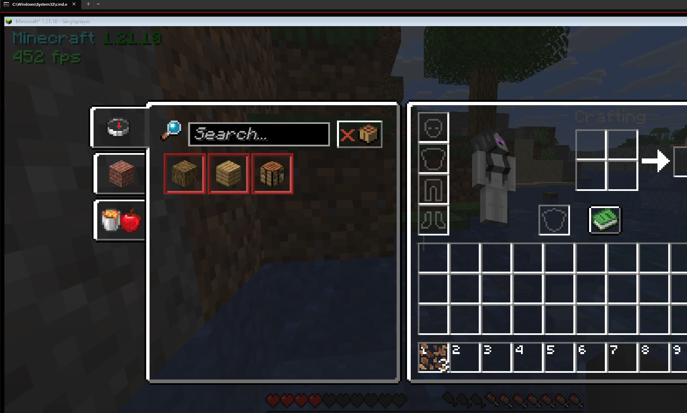
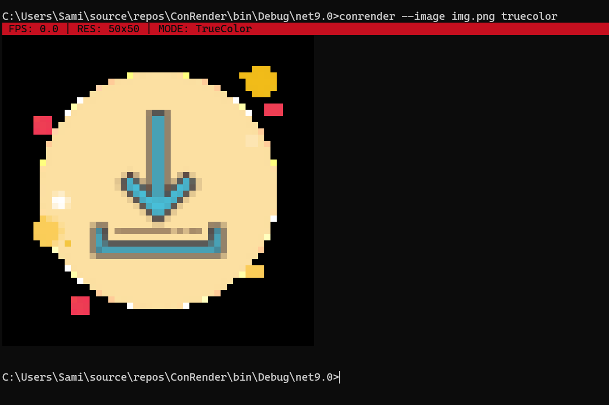

# ConRender

ConRender is a console renderer that captures real windows, images, and optionally the mouse cursor, then renders them as ANSI output in the terminal.

### Capturing a Minecraft window

### Rendering an image to the console

